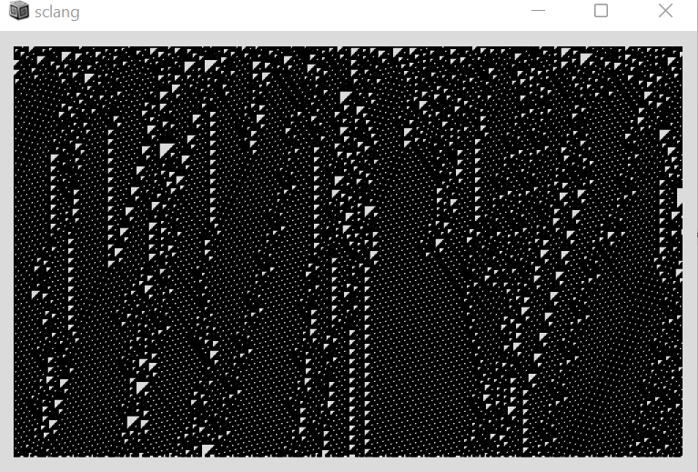

# A Journey Through Latent Space 
A program that takes you on a continuous interpolation through the manifold of melodies. 

The process of composing using some kind of stochastic or chaotic process consists of two parts. First, specifying an abstract mathematical process such as a cellular automaton or a random walk, and second, mapping the outcome of that process onto a musical notation or directly to sound. Approaches to the second task might be as crude as treating a 2D grid as a piano roll, or more thought out such as in Iannis Xenakis' cellular automata.

The central idea of this program is to map mathematical structures onto music using deep neural networks, in particular using a model called a *variational autoencoder* (VAE). A VAE is a kind of compression algorithm, where the aim is to project the training data into some low-dimensional *latent-space*, such as a continuous 2D grid, and then be able to recover the original training examples from only their low-dimensional compression. The twist is that if we pick a random point in the latent-space that does not correspond to a seen training example and decompress it, we generate a brand-new sample that resembles the training data.

The high-level overview of this music-generating program is as follows: 

1. Simulation: simulate an elementary cellular automaton in supercollider. 
2. VAE: Interpret each state of the cellular automaton as a point in the latent space of a cellular automaton. This associates a short musical phrase to each state of the cellular automaton. 
3. Synthesis: Synthesize the musical phrases output by the VAE in Supercollider. 
4. Visualization: Visualize the cellular automaton at the same time as step (3) is playing music. 

The particular VAE we use is a pre-trained model called [MusicVAE](https://github.com/magenta/magenta/tree/main/magenta/models/music_vae) that maps 512 dimensional vectors to 1 bar MIDI melodies.

Here's a sample cellular automaton simulation: 



## Setup

Below are instructions for running the project. 

### Prerequisites
Requires a Unix system with `python3`, `pip3`, and `gcc` installed. 

### Packages 
Make sure you have the following packages installed 
```
libfluidsynth1 
fluid-soundfont-gm 
build-essential 
libasound2-dev 
libjack-dev
```

### Python environment
Run the following command to install all necessary python libraries. 
```
pip3 install pyfluidsynth magenta
```
I have run into `gcc` issues when trying to install `magenta` in a conda environment. If you are getting `gcc` errors, try disabling conda. 

In case you keep running into compatibility issues with the python script, I've provided sample outputs from my local runs (see `final_proj.scd`). 

### Running the program
Open `final_proj.scd` in the SuperCollider IDE. 
